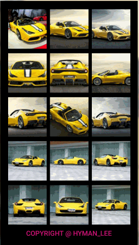

GridView-Item-Rotate
====================
###1. Demo Download
[本地下载](apk/gridview-item-rotate.apk?raw=true "点击下载到本地")  

###2. Screenshot
  

###3. Description
In this little project , I achieved a effect of turning over playing cards , which is based on a GridView.  items of ths GridView can flip with a rotate animation such as turning over cards. what's more, when u shake your device the picture in item will be changed.
The Rotate function in my project refer to [**3DNumberRotate**](https://github.com/jianghejie/3DNumberRotate) created by jianghejie, it very nice! thank you! Besides, I used **universal-image-loader** to download online pictures.

###4、Contact Me
blog: [http://www.cnblogs.com/page-of-Hyman/](http://www.cnblogs.com/page-of-Hyman/)  
Github: [https://github.com/MrBigBang](https://github.com/MrBigBang)  
**Wellcome to point out the bug and give me advices!**

### MIT License
The MIT License (MIT)

    Copyright (c) 2015 hyman lee

    Permission is hereby granted, free of charge, to any person obtaining a copy
    of this software and associated documentation files (the "Software"), to deal
    in the Software without restriction, including without limitation the rights
    to use, copy, modify, merge, publish, distribute, sublicense, and/or sell
    copies of the Software, and to permit persons to whom the Software is
    furnished to do so, subject to the following conditions:

    The above copyright notice and this permission notice shall be included in
    all copies or substantial portions of the Software.

    THE SOFTWARE IS PROVIDED "AS IS", WITHOUT WARRANTY OF ANY KIND, EXPRESS OR
    IMPLIED, INCLUDING BUT NOT LIMITED TO THE WARRANTIES OF MERCHANTABILITY,
    FITNESS FOR A PARTICULAR PURPOSE AND NONINFRINGEMENT. IN NO EVENT SHALL THE
    AUTHORS OR COPYRIGHT HOLDERS BE LIABLE FOR ANY CLAIM, DAMAGES OR OTHER
    LIABILITY, WHETHER IN AN ACTION OF CONTRACT, TORT OR OTHERWISE, ARISING FROM,
    OUT OF OR IN CONNECTION WITH THE SOFTWARE OR THE USE OR OTHER DEALINGS IN
    THE SOFTWARE.